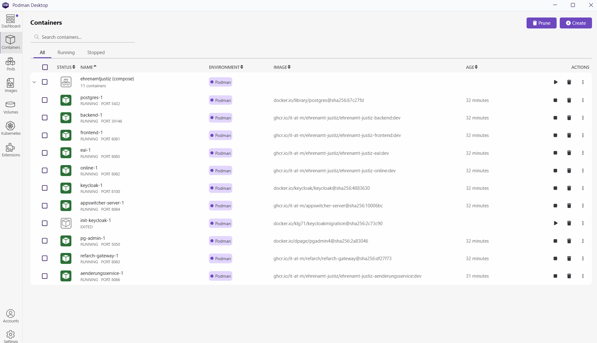
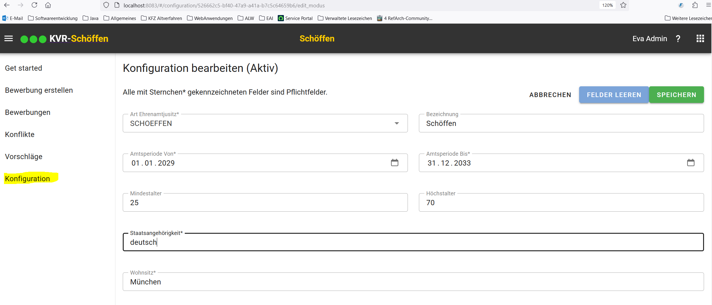
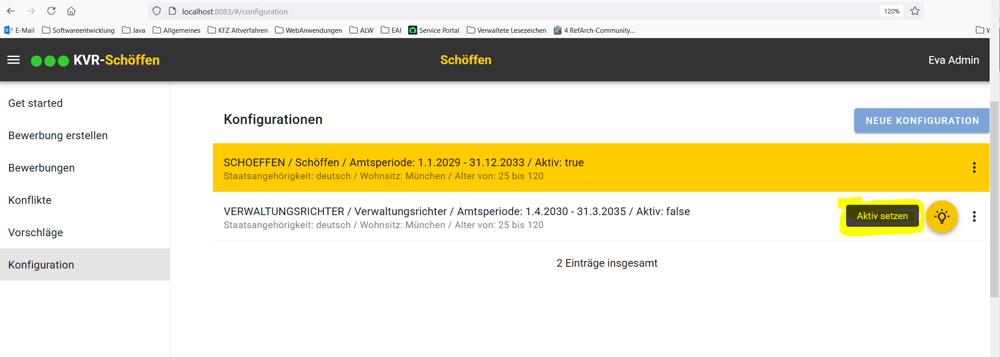
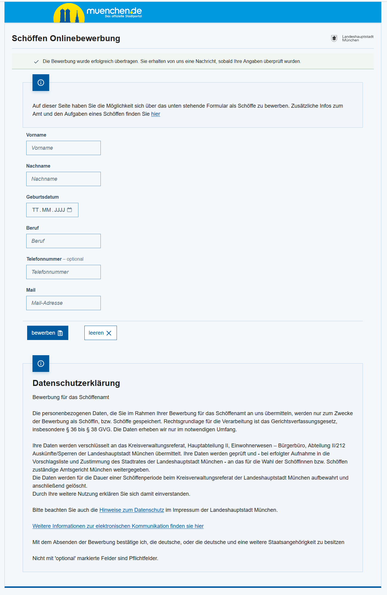
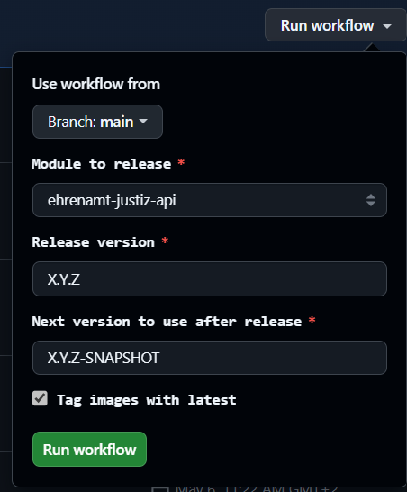
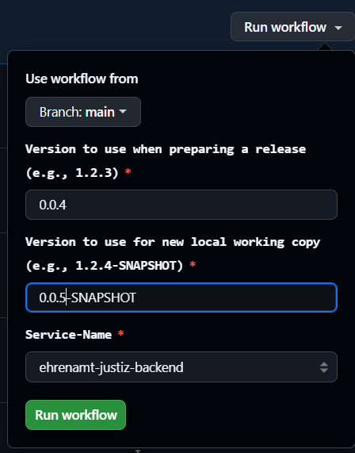
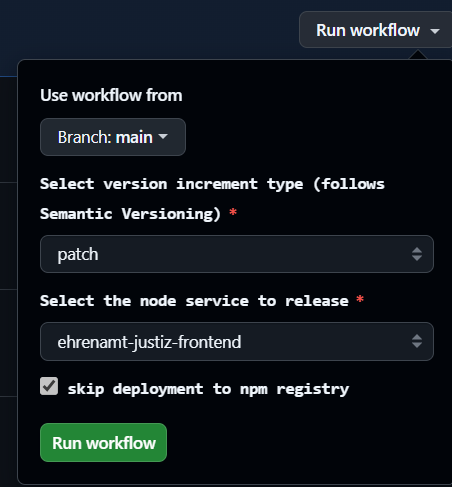

<!-- General project links -->
[open-issues]: https://github.com/it-at-m/ehrenamt-justiz/issues
[new-issue]: https://github.com/it-at-m/ehrenamt-justiz/issues/new/choose
[milestones]: https://github.com/it-at-m/refarch-templates/milestones
[project-board]: https://github.com/orgs/it-at-m/projects/16
[documentation]: https://refarch-templates.oss.muenchen.de/
[itm-opensource]: https://opensource.muenchen.de/
[license]: ../LICENSE
[code-of-conduct]: ./CODE_OF_CONDUCT.md

<!-- Project specific links -->
[refarch-documentation]: https://refarch.oss.muenchen.de/
[refarch-code]: https://github.com/it-at-m/refarch
[spring-documentation]: https://spring.io/ 
[vuejs-documentation]:  https://vuejs.org/
[getting-started-documentation]: https://refarch-templates.oss.muenchen.de/getting-started.html
[develop-documentation]: https://refarch-templates.oss.muenchen.de/develop.html
[document-documentation]: https://refarch-templates.oss.muenchen.de/document.html
[organize-documentation]: https://refarch-templates.oss.muenchen.de/organize.html

<!-- Shields.io links -->
[documentation-shield]: https://img.shields.io/badge/documentation-blue?style=for-the-badge
[new-issue-shield]: https://img.shields.io/badge/new%20issue-blue?style=for-the-badge
[made-with-love-shield]: https://img.shields.io/badge/made%20with%20%E2%9D%A4%20by-it%40M-yellow?style=for-the-badge
[license-shield]: https://img.shields.io/github/license/it-at-m/refarch-templates?style=for-the-badge

# Ehrenamtjustiz

[![New issue][new-issue-shield]][new-issue]
[![Made with love by it@M][made-with-love-shield]][itm-opensource]
[![GitHub license][license-shield]][license]


## General

It was decided to replace the legacy application “Schöffenverwaltung”, which was used by the District Administration Department until 2024, with a MAKE application based on the it@M reference architecture. The requirement that the specialist procedure can supports the application for the office of lay judge and honorary judges at the Administrative Court without a change request will be taken into account. This new application is referred to as “Ehrenamtjustiz”.
The application Ehrenamtjustiz supports the clerk in the District Administration Department in recording and managing applicants, resolving conflicts in the residents' registration data and drawing up the list of proposals for lay judge and honorary judges at the Administrative Court . Citizens can also apply for aldermen online.

Ehrenamtsjustiz based on the RefArch (reference architecture) of it@M.

To learn more about the architecture itself, checkout its [documentation][refarch-documentation] or [code][refarch-code].

The templates are based on [Spring][spring-documentation] and [Vue.js][vuejs-documentation].


## System overview

<p>
    
</p>

### Built With

The project is built with technologies we use in our projects
([reference architecture](https://opensource.muenchen.de/publish.html#refarch)):

* [Spring Boot](https://spring.io/projects/spring-boot)
* [Vue.js](https://vuejs.org/)
* [Vuetify](https://vuetifyjs.com/)
* [nginx](https://nginx.org)
* [PostgreSQL](https://www.postgresql.org)
* [Flyway](https://github.com/flyway/flyway)
* [Apache Camel](https://camel.apache.org)
* [Podman](https://www.podman.io)


## Get Ready to use Ehrenamtjustiz local in Podman


### Clone Repository from github
```
mkdir ~/develop
cd ~/develop   
git clone https://github.com/it-at-m/ehrenamt-justiz.git
cd ehrenamt-justiz
```


### Manual adaption for starting the EAI

#### Manually adjust the source entrypoint.sh (~/develop\ehrenamt-justiz\ehrenamt-justiz-eai\entrypoint.sh)

Details can be found in the documentation here:

[ehrenamt-justiz/ehrenamt-justiz-eai/entrypoint.sh](https://github.com/it-at-m/ehrenamt-justiz/blob/main/ehrenamt-justiz-eai/entrypoint.sh)

#### Manually adjust the user and password in docker-compose.yml (~\develop\ehrenamt-justiz\stack\docker-compose.yml) for calling the EAI:
```
  eai:
   ...
    environment:
      - PRODUCER_USER=
      - PRODUCER_PASSWORD=
```

### Manual work for starting the EJ change service 
The following must be done to use the EJ change service (Kafka)
- Copy kafka-auth-keystore.jks and truststore.jks (Can be found in Keystore for Ehrenamt-Justiz) to folder ~/develop/ehrenamt-justiz/ehrenamt-justiz-aenderungsservice/src/main/resources
- Manually add the user and password in  ~/develop/ehrenamt-justiz/stack/docker-compose.yml (User and password can be found in Keystore for Ehrenamt-Justiz)
  ```
  services:
    ...
    aenderungsservice:
      ...
      environment:
      ...
      - KEY_STORE_PASSWORD=
      - TRUST_STORE_PASSWORD=
  ```
- Manually set the GROUP_ID (The Group ID identifies a group of consumer instances that jointly consume messages from one or more Kafka topics)  in  ~/develop/ehrenamt-justiz/stack/docker-compose.yml for kafka. 
  ```
  services:
    ...
    aenderungsservice:
      ...
      environment:
      ...
        - GROUP_ID=lhm-ewo-eai-aenderungen-ehrenamt-justiz...
  ```
### Starting Ehrenamtjustiz in Podman
```
cd ~/develop/ehrenamt-justiz/stack  
podman compose --profile=backend --profile=frontend --profile=eai --profile=online --profile=aenderungsservice up -d
```

These containers are started:
<p>
    
</p>


### Start EJ application in browser
```
url: http://localhost:8083
```

<p>
    
</p>

#### Users

These users are only for testing purpose in podman:

| user | Description | role | password |
| ------------- | ------------- | ------------- | ------------- |
| nosach  | normal user with basic rights |  clientrole_sachbearbeiter | nosach |
| sosach | users with extended rights | clientrole_sondersachbearbeiter | sosach |
| soadmin  |  administrator rights | clientrole_administrator | soadmin |

#### Active Configuration
After starting the application for the first time, an active configuration must first be created. All data is saved under this configuration.

##### Create configuration
<p>
    
</p>

##### Activate configuration
<p>
    
</p>

### Start online application in browser
```
url: http://localhost:8083/public/online/
```

<p>
    
</p>


### Stop Container for Ehrenamtjustiz in Podman
`podman compose --profile=backend --profile=frontend --profile=eai --profile=online --profile=aenderungsservice stop`

## Build releases

### Build release of api

1. Open action for api release: 
2. Click on "view runs"
3. Click on "run workflow"
4. Select branch, module to release (ehrenamtjustiz-api), release version (e.g. 1.0.0) and next version to use after release (e.g. 1.0.1-SNAPSHOT)
5. Click on "Run workflow"
   


6. Check running action
7. Releases saved in the central Maven repository (https://central.sonatype.com/search?q=ehrenamt-justiz). Wait, wait and wait until it is there.
8. Update api-versions in pom.xml in backend and aenderungsservice and eai and build releases

### Build release of backend, eai and aenderungsservice

1. Open action for maven release: 
2. Click on "view runs"
3. Click on "run workflow"
4. Select branch, version to use when preparing a release (e.g. 0.0.4) and version to use for new local working copy (e.g. 0.0.5-SNAPSHOT) and Service-Name (ehrenamt-justiz-backend, ehrenamt-justiz-eai or ehrenamt-justiz-aenderungsservice)
5. Click on "Run workflow"
   


6. Check running action
7. Releases can be found here: 
8. Update versions in docker-compose.yml for podman

### Build release of frontend und online

1. Open action for npm release: 
2. Click on "view runs"
3. Click on "run workflow"
4. Select branch, version increment type (patch, minor or major) and node service to release
5. Click on "Run workflow"



6. Check running action
7. Releases can be found here: 
8. Update versions in docker-compose.yml for podman

## Contributing

Contributions are what make the open source community such an amazing place to learn, inspire, and create. Any contributions you make are **greatly appreciated**.

If you have a suggestion that would make this better, please [open an issue][new-issue] and fill out the appropriate issue form with as much information as possible.
If you want to work on a solution, fork the repo and create a pull request.
Don't forget to give the project a star! Thanks again!

More about this in the [CODE_OF_CONDUCT][code-of-conduct] file.


## License

Distributed under the MIT License. See [LICENSE][license] file for more information.


## Contact

it@M - opensource@muenchen.de
