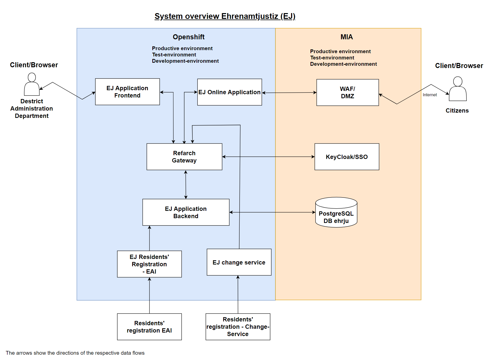

<!-- General project links -->
[open-issues]: https://github.com/it-at-m/ehrenamt-justiz/issues
[new-issue]: https://github.com/it-at-m/ehrenamt-justiz/issues/new/choose
[milestones]: https://github.com/it-at-m/refarch-templates/milestones
[project-board]: https://github.com/orgs/it-at-m/projects/16
[documentation]: https://refarch-templates.oss.muenchen.de/
[itm-opensource]: https://opensource.muenchen.de/
[license]: ../LICENSE
[code-of-conduct]: ./CODE_OF_CONDUCT.md

<!-- Project specific links -->
[refarch-documentation]: https://refarch.oss.muenchen.de/
[refarch-code]: https://github.com/it-at-m/refarch
[spring-documentation]: https://spring.io/ 
[vuejs-documentation]:  https://vuejs.org/
[getting-started-documentation]: https://refarch-templates.oss.muenchen.de/getting-started.html
[develop-documentation]: https://refarch-templates.oss.muenchen.de/develop.html
[document-documentation]: https://refarch-templates.oss.muenchen.de/document.html
[organize-documentation]: https://refarch-templates.oss.muenchen.de/organize.html

<!-- Shields.io links -->
[documentation-shield]: https://img.shields.io/badge/documentation-blue?style=for-the-badge
[new-issue-shield]: https://img.shields.io/badge/new%20issue-blue?style=for-the-badge
[made-with-love-shield]: https://img.shields.io/badge/made%20with%20%E2%9D%A4%20by-it%40M-yellow?style=for-the-badge
[license-shield]: https://img.shields.io/github/license/it-at-m/refarch-templates?style=for-the-badge

# Ehrenamtjustiz

[![New issue][new-issue-shield]][new-issue]
[![Made with love by it@M][made-with-love-shield]][itm-opensource]
[![GitHub license][license-shield]][license]


## General

It was decided to replace the legacy application “Schöffenverwaltung”, which was used by the District Administration Department until 2024, with a MAKE application based on the it@M reference architecture. The requirement that the specialist procedure can supports the application for the office of lay judge and honorary judges at the Administrative Court without a change request will be taken into account. This new application is referred to as “Ehrenamtjustiz”.
The application Ehrenamtjustiz supports the clerk in the District Administration Department in recording and managing applicants, resolving conflicts in the residents' registration data and drawing up the list of proposals for lay judge and honorary judges at the Administrative Court . Citizens can also apply for aldermen online.

Ehrenamtsjustiz based on the RefArch (reference architecture) of it@M.

To learn more about the architecture itself, checkout its [documentation][refarch-documentation] or [code][refarch-code].

The templates are based on [Spring][spring-documentation] and [Vue.js][vuejs-documentation].


## System overview

<p>
    
</p>


## Get Ready to use Ehrenamtjustiz local in Docker Desktop


### Clone Repository from github
```
mkdir ~/develop
cd ~/develop   
git clone https://github.com/it-at-m/ehrenamt-justiz.git
```


### Manually adjust the source entrypoint.sh for starting the EAI
This is only necessary for starting the eai!
Details can be found in the documentation here:

[ehrenamt-justiz/ehrenamt-justiz-eai/entrypoint.sh](https://github.com/it-at-m/ehrenamt-justiz/blob/main/ehrenamt-justiz-eai/entrypoint.sh)


### Manual work for starting the change service
The following must be done to use the EJ change service (Kafka)
- Copy kafka-auth-keystore.jks and truststore.jks (Can be found in Keystore for Ehrenamt-Justiz) to folder ~/develop/ehrenamt-justiz/ehrenamt-justiz-aenderungsservice/src/main/resources
- Manually add the user and password in  ~/develop/ehrenamt-justiz/stack/docker-compose.yml (User and password can be found in Keystore for Ehrenamt-Justiz)
  ```
  services:
    ...
    aenderungsservice:
      ...
      environment:
      ...
      - KEY_STORE_PASSWORD=
      - TRUST_STORE_PASSWORD=
  ```


### Starting Ehrenamtjustiz in Docker Desktop
```
cd ~/develop/ehrenamt-justiz/stack  
docker-compose --profile=backend --profile=frontend --profile=eai --profile=online --profile=aenderungsservice up -d
```

These containers are started:
<p>
    
</p>


### Open application in browser
```
url: http://localhost:8083
```

```
User: soadmin
Password: soadmin
```

<p>
    
</p>


### Stop Container for Ehrenamtjustiz in Docker Desktop
`docker-compose --profile=backend --profile=frontend --profile=eai --profile=online --profile=aenderungsservice stop`


## Contributing

Contributions are what make the open source community such an amazing place to learn, inspire, and create. Any contributions you make are **greatly appreciated**.

If you have a suggestion that would make this better, please [open an issue][new-issue] and fill out the appropriate issue form with as much information as possible.
If you want to work on a solution, fork the repo and create a pull request.
Don't forget to give the project a star! Thanks again!

More about this in the [CODE_OF_CONDUCT][code-of-conduct] file.


## License

Distributed under the MIT License. See [LICENSE][license] file for more information.


## Contact

it@M - opensource@muenchen.de
