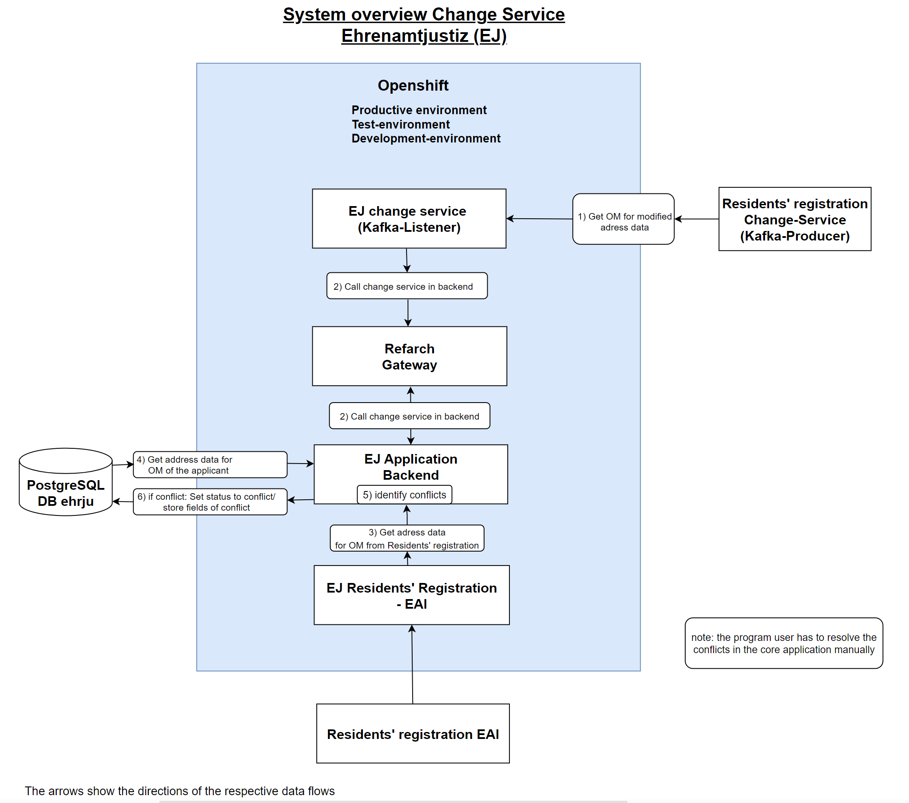
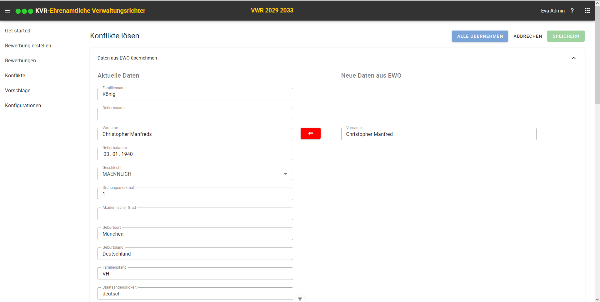

# Residents registration change service  of Ehrenamt-Justiz

The Residents registration (EWO) offers a job for push notifications that ensures that change notifications are sent smoothly and regularly to Ehrenamt-Jusitz.
The changes from EWO are transmitted to us via Apcache Kafka queues. The Residents registration change service receives changed personal data and and determines conflicts (Conflicts arise if the applicant data in Ehrenamt-Jusitz is different from the Residents registration data)

## System overview

<p>
    
</p>

Conflicts are dealt with and resolved in the coe application:
<p>
    
</p>

## Konfiguration of Kafka service
To retrieve the data from apache kafka service, the following settings must be made:

application-[profile].yml
```
aenderungsservice:
...
  topicPattern: lhm-ewo-eai-aenderungen-.*
  group-Id: lhm-ewo-eai-aenderungen-ehrenamt-justiz
  ```

| Konfiguration | Description | Default setting | example |
| ------------- | ------------- | ------------- | ------------- |
| topicPattern  | Kafka-Topics. Has to be 'lhm-ewo-eai-aenderungen-.*' | lhm-ewo-eai-aenderungen-.* | |
| group-Id | Identifies a group of consumer instances that jointly consume messages from one or more Kafka topics. Has to start with 'lhm-ewo-eai-aenderungen-ehrenamt-justiz'. Attention: if you change an already used groupid here, all already processed om's will be processed again by the change service of Ehrenamt-Justiz. This change can be useful in the test phase of Ehrenamt-Jusitz, but it is not recommended in the production environment | lhm-ewo-eai-aenderungen-ehrenamt-justiz | lhm-ewo-eai-aenderungen-ehrenamt-justiz001 |

The following configurations must be carried out so that the change service can call up the backend

application-[profile].yml
```
aenderungsservice:
  backend:
    server: http://localhost:8083
    base-path: /public/aenderungsservice
    connecttimeout: 30000
    readtimeout: 30000
    retry:
      maxRetries: 30
      initialInterval: 5000
      multiplier: 2.0
      maxInterval: 80000
  ```
| Konfiguration | Description | Default setting |
| ------------- | ------------- | ------------- |
| server  | Host server of backend | 'http://localhost:8083' |
| base-path | Has to be '/public/aenderungsservice' | /public/aenderungsservice |
| connecttimeout | Timeout when calling the backend. In milliseconds | 30000 |
| readtimeout | Readtimeout when calling the backend. In milliseconds | 30000 |
| maxRetries | Configuration is used, if blocking entry. Maximum number of calls if, for example, a timeout occurs when calling up the backend | 30 |
| initialInterval | Configuration is used, if blocking entry. Waiting time after the first incorrect call of the backend | 5000 |
| multiplier | Configuration is used, if blocking entry. Multiplier for the waiting time after a faulty call of the backend | 2.0 |
| maxInterval | Configuration is used, if blocking entry. Maximum waiting time  | 80000 |

A “blocking entry” in Kafka listener contexts refers to a situation where a consumer (in this case a Kafka listener) is blocked from processing messages and is unable to consume new messages from a Kafka partition until the current processing is complete (For example, timeout when calling the backend or when calling the Residents registration EAI).
