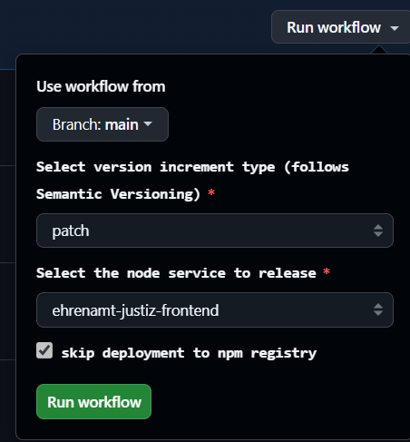

# Residents registration change service  of Ehrenamt-Justiz

The Residents registration service offers a job for push notifications that ensures that change notifications are sent smoothly and regularly to Ehrenamt-Justiz.
These changes are transmitted to us via Apcache Kafka queues. The Residents registration change service receives changed personal data and and determines conflicts (Conflicts arise if the applicant data in Ehrenamt-Justiz is different from the Residents registration data)

## System overview


Conflicts are dealt with and resolved in the core application:


## Configuration of Kafka service
### Settings in application-[profile].yml
To retrieve the data from apache kafka service, the following settings must be made:

application-[profile].yml
```yaml
spring:
  kafka:
    bootstrap-servers: ...
    security.protocol: SSL
    ssl:
      key-store-password: ...
      trust-store-password: ...
      key-store-location: file:/etc/ssl/kafka-auth-keystore.jks
      trust-store-location: file:/etc/ssl/truststore.jks
    client-id: lhm-ewo-eai-schoeffen
    consumer: # Only insert everything below here if you wish to receive unread messages with the listener when it was inactive. Otherwise, only the messages that were sent during the active time of the listener will be received.
      auto-offset-reset: earliest
      enable-auto-commit: true
...
aenderungsservice:
...
  topicPattern: lhm-ewo-eai-aenderungen-.*
  group-Id: lhm-ewo-eai-aenderungen-ehrenamt-justiz
  ```
Settings in detail:

| Configuration | Description | Default setting | example |
| ------------- | ------------- | ------------- | ------------- |
| spring.kafka.bootstrap-server  | hostname:port that address the kafka-broker |  |  |
| spring.kafka.ssl.security.protocol | https://docs.spring.io/spring-kafka/reference | SSL  |  |
| spring.kafka.ssl.key-store-password | password for key-store | see keypass |  |
| spring.kafka.ssl.trust-store-password | password for truststore | see keypass |  |
| spring.kafka.ssl.key-store-location | location of key-store | file:/etc/ssl/kafka-auth-keystore.jks |  |
| spring.kafka.ssl.trust-store-location | location of trust-store | file:/etc/ssl/truststore.jks |  |
| spring.kafka.client-id | https://docs.spring.io/spring-kafka/reference | lhm-ewo-eai-schoeffen |  |
| spring.kafka.consumer.auto-offset-reset | https://docs.spring.io/spring-kafka/reference | earliest |  |
| spring.kafka.consumer.enable-auto-commit | https://docs.spring.io/spring-kafka/reference | true |  |
| aenderungsservice.topicPattern  | Kafka-Topics. Has to be 'lhm-ewo-eai-aenderungen-.*' | lhm-ewo-eai-aenderungen-.* | |
| aenderungsservice.group-Id | Identifies a group of consumer instances that jointly consume messages from one or more Kafka topics. Has to start with 'lhm-ewo-eai-aenderungen-ehrenamt-justiz'. Attention: if you change an already used groupid here, all already processed om's will be processed again by the change service of Ehrenamt-Justiz. This change can be useful in the test phase of Ehrenamt-Jusitz, but it is not recommended in the production environment | lhm-ewo-eai-aenderungen-ehrenamt-justiz | lhm-ewo-eai-aenderungen-ehrenamt-justiz001 |

### Certificates
Certificates are required to use the kafka service
The current certificates and passwords are stored in KeePass: kafka-auth-keystore.jks and truststore.jks

If the change service is executed in podman, the certificates must be saved here relative to the “stack” directory:
```
../ehrenamt-justiz-aenderungsservice/src/main/resources/truststore.jks
../ehrenamt-justiz-aenderungsservice/src/main/resources/kafka-auth-keystore.jks
```
It is also necessary to set the spring.kafka.ssl.key-store-password and spring.kafka.ssl.trust-store-password in application-docker.yml. The other settings are already defined for podman so that they can be used with the LHM Munich change service.

### Call the backend by the change service

The following configurations must be carried out so that the change service can call up the backend service

application-[profile].yml
```yaml
aenderungsservice:
  backend:
    server: http://localhost:8083
    base-path: /public/backendaenderungsservice
    connecttimeout: 30000
    readtimeout: 30000
    retry:
      maxRetries: 30
      initialInterval: 5000
      multiplier: 2.0
      maxInterval: 80000
  ```
| Configuration | Description | Default setting |
| ------------- | ------------- | ------------- |
| server  | Host server of backend | 'http://localhost:8083' |
| base-path | Has to be '/public/backendaenderungsservice' | /public/backendaenderungsservice |
| connecttimeout | Timeout when calling the backend. In milliseconds | 30000 |
| readtimeout | Readtimeout when calling the backend. In milliseconds | 30000 |
| maxRetries | Configuration is used, if blocking entry. Maximum number of calls if, for example, a timeout occurs when calling up the backend | 30 |
| initialInterval | Configuration is used, if blocking entry. Waiting time after the first incorrect call of the backend | 5000 |
| multiplier | Configuration is used, if blocking entry. Multiplier for the waiting time after a faulty call of the backend | 2.0 |
| maxInterval | Configuration is used, if blocking entry. Maximum waiting time  | 80000 |

A “blocking entry” in Kafka listener contexts refers to a situation where a consumer (in this case a Kafka listener) is blocked from processing messages and is unable to consume new messages from a Kafka partition until the current processing is complete (For example, timeout when calling the backend or when calling the Residents registration EAI).

## Start change service
Change to the folder "ehrenamt-justiz-aenderungsservice" and call the following scripts depending on your operating system

| Betriebssystem | Profile            |  Script                 |
|:---------------|:-------------------|:------------------------|
| Windows        | Local              | runLocal.bat            |
| Windows        | Local, nosecurity  | runLocalNoSecurity.bat  |
| Linux          | Local              | runLocal.sh             |
| Linux          | Local, nosecurity  | runLocalNoSecurity.bat  |


# Logging

Logging is controlled via the configuration file application-*.yml. logback-spring.xml is no longer used.

Example:

```yaml
logging:
  include-application-group: false # disabled because application group is only relevant when deployed
  structured:
    format:
      console: # set to empty to disable structured logging locally
  level:
    root: INFO
    de.muenchen.ehrenamtjustiz.aenderungsservice: DEBUG
    org.springframework.cache: TRACE
    org.springframework.web: DEBUG
    org.springframework.security: debug
```

# Build releases

## build release of api

1. Open action for maven release: 
2. Click on "view runs"
3. Click on "run workflow"
4. Select branch, module to release (ehrenamtjustiz-api), release version (e.g. 1.0.0) and next version to use after release (e.g. 1.0.1-SNAPSHOT)
5. Click on "Run workflow"
   


6. Check running action
7. Releases saved in the central Maven repository (https://central.sonatype.com/search?q=ehrenamt-justiz). Wait, wait and wait until it is there.
8. Update api-versions in pom.xml in backend and aenderungsservice and eai and build releases

## build release of backend, eai and aenderungsservice

1. Open action for maven release: 
2. Click on "view runs"
3. Click on "run workflow"
4. Select branch, version to use when preparing a release and version to use for new local working copy and Service-Name
5. Click on "Run workflow"
   


6. Check running action
7. Release can be found here: 
8. Update versions in docker-compose.yml for podman

## build release of frontend und online

1. Open action for npm release: 
2. Click on "view runs"
3. Click on "run workflow"
4. Select branch, version increment type (patch, minor or major) and node service to release
5. Click on "Run workflow"



6. Check running action
7. Release can be found here: 
8. Update versions in docker-compose.yml for podman
