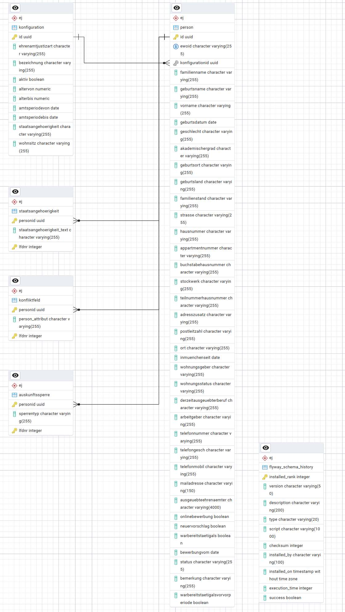
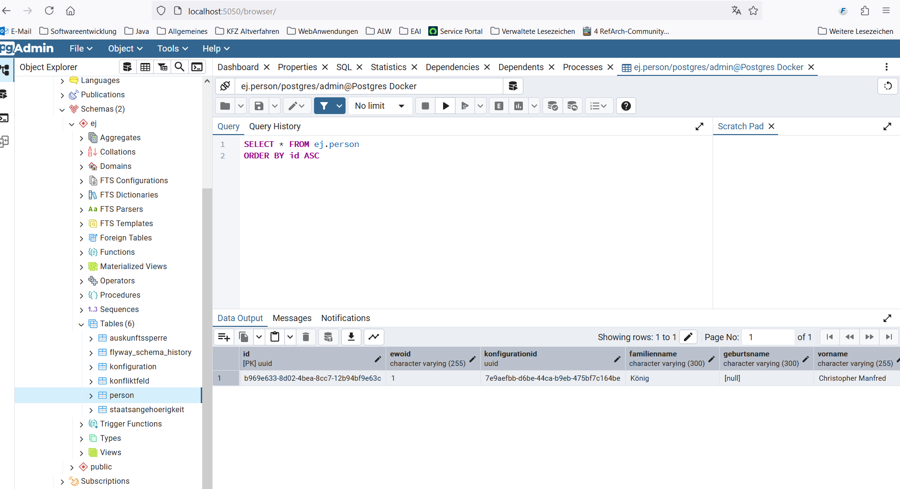

# Database schema

## Start backend
Change to the folder "ehrenamt-justiz-backend" and call the following scripts depending on your operating system

| Betriebssystem | Profile            |  Script                 |
|:---------------|:-------------------|:------------------------|
| Windows        | Local              | runLocal.bat            |
| Windows        | Local, nosecurity  | runLocalNoSecurity.bat  |
| Linux          | Local              | runLocal.sh             |
| Linux          | Local, nosecurity  | runLocalNoSecurity.bat  |

## ER-Diagramm
The following figure shows the ER diagram with all tables and the relationships between them.



## Tables in Database schema
The database schema currently contains 6 tables. The following table lists all the DB tables contained in the DB schema with their description.

| Table                    | Description                                                                     | 
|:-------------------------|:--------------------------------------------------------------------------------|
| konfiguration            | Configuration values (e.g. term of office from-to)                              |
| person                   | Personal data (EWO and additional data) for applicants, conflicts and proposals | 
| staatsangehoerigkeit     | Contains the nationalities of an applicant                                      | 
| konfliktfeld             | Contains the conflict fields (changes to EWO)                                   | 
| auskunftssperre          | This table provides information on information blocks                           |
| flyway_schema_history    | Technical change history of the database (Flyway)                               |

## Database server
The PostgreSQL database servers requested for the individual environments in the MIA server network segment are listed in the following table.

| Server (:Port)                         | Environment | OS       | Description/DB schema                              |
|:---------------------------------------|:------------|:---------|:---------------------------------------------------|
| not yet applied for                    | Production  | RHEL 8   | PostgreSQL-Database server ehrju (PostgreSQL 16.6) |
| ehrjudpk001.srv.muenchen.de:5432       | Testing     | RHEL 8   | PostgreSQL-Database server ehrju (PostgreSQL 16.6) |
| ehrjudpc001.srv.muenchen.de:5432       | Coding      | RHEL 8   | PostgreSQL-Datenbankserver ehrju (PostgreSQL 16.6) |

### SQL-Commands 
The following SQL command can be used to link all tables for an evaluation, for example:    
```
select p.vorname, p.familienname, k.bezeichnung, s.staatsangehoerigkeit_text, f.person_attribut, a.sperrentyp from ehrju.person p
left outer join ehrju.konfiguration k on k.id = p.konfiguration_id
left outer join ehrju.staatsangehoerigkeit s on s.person_id = p.id
left outer join ehrju.konfliktfeld f on f.person_id = p.id
left outer join ehrju.auskunftssperre a on a.person_id = p.id
order by p.familienname asc
```

### Changes to the database schema
Changes to the database schema are made using the Flyway framework (https://www.red-gate.com/products/flyway/).
Changes to the database schema are made here:

Only new files may be created here. Existing files may not be changed.

Important Maven commands in connection with Flyway:
| Command                  | Description                                                 | 
|:-------------------------|:------------------------------------------------------------|
| mvn flyway:info          | Get information about current database                      |
| mvn flyway:repair        | Corrects an incorrect migration. After correcting the migration SQL commands, execute the migration again  |

# Configure backend

The following table shows the most important configurations of the backend (application-[profile].yml):

| Configuration | Description | Example setting |
| ------------- | ------------- | ------------- |
| spring.port | Port used to run the spring boot application  | 39146 |
| ewo.eai.server | url and port of EAI to residents' registration system | http://host.docker.internal:8085 |
| ewo.eai.user | User for EAI to residents' registration system |  |
| ewo.eai.password | Password forEAI to residents' registration system |  |
| sso.url |url and port to keycloak server | http://kubernetes.docker.internal:8100 |
| sso.real | Realm used in keycloak | local_realm |
| sso.client | Client used in keycloak | ej-app |
| spring.datasource.url | url, port and schema of database | jdbc:postgresql://host.docker.internal:5432/postgres?currentSchema=ej |
| spring.datasource.username | Username for connecting to database |  |
| spring.datasource.password | Password for connecting to database |  |

# pgAdmin

The GUI ‘pgAdmin’ serves as a graphical interface to the PostgreSQL database.
If the database und pgAdmin were started in docker desktop, then pgAdmin can be started in the browser with this address: 
```
http://localhost:5050/browser/
```



## User, roles and authorizations

Users, roles and authorizations are defined in this repository for keycloak (dev) and for docker desktop.

The definition files for keycloak can be found here:  [keycloak files](https://github.com/it-at-m/ehrenamt-justiz/tree/main/ehrenamt-justiz-backend/sso-config)

### Users

Users for docker desktop are defined here:
[Users for docker desktop](https://github.com/it-at-m/ehrenamt-justiz/blob/main/stack/keycloak/migration/04_add-users.yml)

These users are only for testing purpose in docker desktop:

| user | Description | role | password |
| ------------- | ------------- | ------------- | ------------- |
| nosach  | normal user with basic rights |  clientrole_sachbearbeiter | nosach |
| sosach | users with extended rights | clientrole_sondersachbearbeiter | sosach |
| soadmin  |  administrator rights | clientrole_administrator | soadmin |


### Roles

Roles are assigned to user for docker desktop here:
[Roles for docker desktop](https://github.com/it-at-m/ehrenamt-justiz/blob/main/stack/keycloak/migration/05_assign-roles.yml)

These assignments are defined:

| User | Role |
| ------------- | ------------- |
| nosach  |clientrole_sachbearbeiter |
| sosach | clientrole_sondersachbearbeiter |
| soadmin  |  clientrole_administrator |


### Authorizations

Authorizations and roles for docker desktop are defined here:
[Authorizations for docker desktop](https://github.com/it-at-m/ehrenamt-justiz/blob/main/stack/keycloak/migration/permissions/example_authorization.json)

These roles are defined:

| Roles | Description |
| ------------- | ------------- |
| clientrole_sachbearbeiter  | role with basic rights |
| clientrole_sondersachbearbeiter | role with extended rights |
| clientrole_administrator  |  role with administrator rights |

These authorizations are defined:

| Authorizations | Assigned roles |
| ------------- | ------------- |
| READ_EWOBUERGER  | ["clientrole_sachbearbeiter", "clientrole_sondersachbearbeiter", "clientrole_administrator"] |
| WRITE_EWOBUERGER | ["clientrole_sachbearbeiter", "clientrole_sondersachbearbeiter", "clientrole_administrator"] |
| DELETE_EWOBUERGER  |  ["clientrole_sondersachbearbeiter", "clientrole_administrator"] |
| READ_EHRENAMTJUSTIZDATEN  |  ["clientrole_sachbearbeiter", "clientrole_sondersachbearbeiter", "clientrole_administrator"] |
| WRITE_EHRENAMTJUSTIZDATEN  |  ["clientrole_sachbearbeiter", "clientrole_sondersachbearbeiter",  "administrator"]  |
| DELETE_EHRENAMTJUSTIZDATEN  |  ["clientrole_sondersachbearbeiter", "clientrole_administrator"] |
| READ_EHRENAMTJUSTIZDATEN_AUSKUNFTSSPERRE  |  ["clientrole_sondersachbearbeiter", "clientrole_administrator"] |
| READ_KONFIGURATION  |  ["clientrole_sachbearbeiter", "clientrole_sondersachbearbeiter",  "administrator"]" |
| WRITE_KONFIGURATION  |  ["clientrole_administrator"] |
| DELETE_KONFIGURATION  | ["clientrole_administrator"] |
| EWOSUCHE  | ["clientrole_sachbearbeiter", "clientrole_sondersachbearbeiter", "clientrole_administrator"]  |
| EWOSUCHEMITOM  |  ["clientrole_sachbearbeiter", "clientrole_sondersachbearbeiter",  "clientrole_administrator"] |
| ONLINEBEWERBEN  |  not used  |

