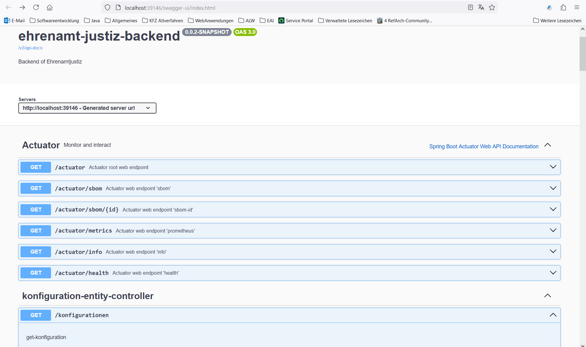
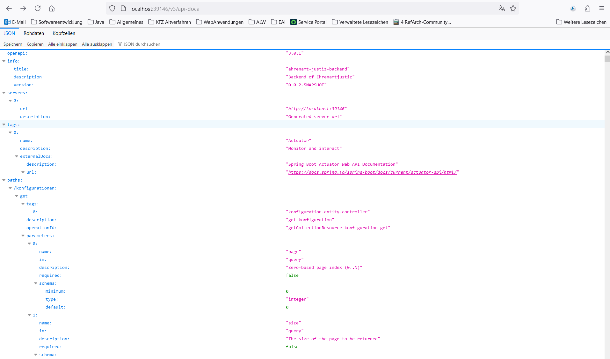

# Database schema

## Start backend local
Change to the folder "ehrenamt-justiz-backend" and call the following scripts depending on your operating system

PLEASE NOTE: To use the permissions, the backend must also be started with the ‘userinfo-authorities’ profile. Otherwise, only the roles will be evaluated. This will change again in the future. Currently, this profile is essential for working with the application.


| Betriebssystem | Profile            |  Script                 |
|:---------------|:-------------------|:------------------------|
| Windows        | Local,userinfo-authorities | runLocal.bat            |
| Windows        | Local, nosecurity  | runLocalNoSecurity.bat  |
| Linux          | Local,userinfo-authorities | runLocal.sh             |
| Linux          | Local, nosecurity  | runLocalNoSecurity.bat  |

## ER-Diagramm
The following figure shows the ER diagram with all tables and the relationships between them.


## Tables in Database schema
The database schema currently contains 6 tables. The following table lists all the DB tables contained in the DB schema with their description.

| Table                    | Description                                                                     | 
|:-------------------------|:--------------------------------------------------------------------------------|
| konfiguration            | Configuration values (e.g. term of office from-to)                              |
| person                   | Personal data (EWO and additional data) for applicants, conflicts and proposals | 
| staatsangehoerigkeit     | Contains the nationalities of an applicant                                      | 
| konfliktfeld             | Contains the conflict fields (changes to EWO)                                   | 
| auskunftssperre          | This table provides information on information blocks                           |
| flyway_schema_history    | Technical change history of the database (Flyway)                               |

## Database server
The PostgreSQL database servers requested for the individual environments in the MIA server network segment are listed in the following table.

| Server (:Port)                         | Environment | OS       | Description/DB schema                              |
|:---------------------------------------|:------------|:---------|:---------------------------------------------------|
| not yet applied for                    | Production  | RHEL 8   | PostgreSQL-Database server ehrju (PostgreSQL 16.6) |
| ehrjudpk001.srv.muenchen.de:5432       | Testing     | RHEL 8   | PostgreSQL-Database server ehrju (PostgreSQL 16.6) |
| ehrjudpc001.srv.muenchen.de:5432       | Coding      | RHEL 8   | PostgreSQL-Datenbankserver ehrju (PostgreSQL 16.6) |

### SQL-Commands 
The following SQL command can be used to link all tables for an evaluation, for example:    
```sql
select p.vorname, p.familienname, k.bezeichnung, s.staatsangehoerigkeit_text, f.person_attribut, a.sperrentyp from ehrju.person p
left outer join ehrju.konfiguration k on k.id = p.konfiguration_id
left outer join ehrju.staatsangehoerigkeit s on s.person_id = p.id
left outer join ehrju.konfliktfeld f on f.person_id = p.id
left outer join ehrju.auskunftssperre a on a.person_id = p.id
order by p.familienname asc
```

### Changes to the database schema
Changes to the database schema are made using the Flyway framework (https://www.red-gate.com/products/flyway/).
Changes to the database schema are made here:

Only new files may be created here. Existing files may not be changed.

Important Maven commands in connection with Flyway:
| Command                  | Description                                                 | 
|:-------------------------|:------------------------------------------------------------|
| mvn flyway:info          | Get information about current database                      |
| mvn flyway:repair        | Corrects an incorrect migration. After correcting the migration SQL commands, execute the migration again  |

# Configure backend

The following table shows the most important configurations of the backend (application-[profile].yml):

| Configuration | Description | Example setting |
| ------------- | ------------- | ------------- |
| spring.port | Port used to run the spring boot application  | 39146 |
| ewo.eai.server | url and port of EAI to residents' registration system | http://host.docker.internal:8085 |
| ewo.eai.user | User for EAI to residents' registration system |  |
| ewo.eai.password | Password forEAI to residents' registration system |  |
| sso.url |url and port to keycloak server | http://keycloak:8100 |
| sso.real | Realm used in keycloak | local_realm |
| sso.client | Client used in keycloak | ej-app |
| spring.datasource.url | url, port and schema of database | jdbc:postgresql://host.docker.internal:5432/postgres?currentSchema=ej |
| spring.datasource.username | Username for connecting to database |  |
| spring.datasource.password | Password for connecting to database |  |
| springdoc.show-actuator | Enables actuator | true |
| springdoc.swagger-ui.enabled | Enable Swagger UI | true |
| springdoc.api-docs.enabled | Enable API docs | true |
| springdoc.api-docs.version | Version of API docs | openapi_3_0 |

# pgAdmin

The GUI ‘pgAdmin’ serves as a graphical interface to the PostgreSQL database.
If the database und pgAdmin were started in podman, then pgAdmin can be started in the browser with this address: 
```
http://localhost:5050/browser/
```


## User, roles and authorizations

Users, roles and authorizations are defined in this repository for keycloak (dev) and for podman.

The definition files for keycloak can be found here:  [keycloak files](https://github.com/it-at-m/ehrenamt-justiz/tree/main/ehrenamt-justiz-backend/sso-config)

### Users

Users for podman are defined here:
[Users for podman](https://github.com/it-at-m/ehrenamt-justiz/blob/main/stack/keycloak/migration/04_add-users.yml)

These users are only for testing purpose in podman:

| user | Description | role | password |
| ------------- | ------------- | ------------- | ------------- |
| nosach  | normal user with basic rights |  clientrole_sachbearbeiter | nosach |
| sosach | users with extended rights | clientrole_sondersachbearbeiter | sosach |
| soadmin  |  administrator rights | clientrole_administrator | soadmin |


### Roles

Roles are assigned to user for podman here:
[Roles for podman](https://github.com/it-at-m/ehrenamt-justiz/blob/main/stack/keycloak/migration/05_assign-roles.yml)

These assignments are defined:

| User | Role |
| ------------- | ------------- |
| nosach  |clientrole_sachbearbeiter |
| sosach | clientrole_sondersachbearbeiter |
| soadmin  |  clientrole_administrator |


### Authorizations

Authorizations and roles for podman are defined here:
[Authorizations for podman](https://github.com/it-at-m/ehrenamt-justiz/blob/main/stack/keycloak/migration/permissions/example_authorization.json)

These roles are defined:

| Roles | Description |
| ------------- | ------------- |
| clientrole_sachbearbeiter  | role with basic rights |
| clientrole_sondersachbearbeiter | role with extended rights |
| clientrole_administrator  |  role with administrator rights |

These authorizations are defined:

| Authorizations | Assigned roles |
| ------------- | ------------- |
| READ_EWOBUERGER  | ["clientrole_sachbearbeiter", "clientrole_sondersachbearbeiter", "clientrole_administrator"] |
| WRITE_EWOBUERGER | ["clientrole_sachbearbeiter", "clientrole_sondersachbearbeiter", "clientrole_administrator"] |
| DELETE_EWOBUERGER  |  ["clientrole_sondersachbearbeiter", "clientrole_administrator"] |
| READ_EHRENAMTJUSTIZDATEN  |  ["clientrole_sachbearbeiter", "clientrole_sondersachbearbeiter", "clientrole_administrator"] |
| WRITE_EHRENAMTJUSTIZDATEN  |  ["clientrole_sachbearbeiter", "clientrole_sondersachbearbeiter",  "administrator"]  |
| DELETE_EHRENAMTJUSTIZDATEN  |  ["clientrole_sondersachbearbeiter", "clientrole_administrator"] |
| READ_EHRENAMTJUSTIZDATEN_AUSKUNFTSSPERRE  |  ["clientrole_sondersachbearbeiter", "clientrole_administrator"] |
| READ_KONFIGURATION  |  ["clientrole_sachbearbeiter", "clientrole_sondersachbearbeiter",  "administrator"]" |
| WRITE_KONFIGURATION  |  ["clientrole_administrator"] |
| DELETE_KONFIGURATION  | ["clientrole_administrator"] |
| EWOSUCHE  | ["clientrole_sachbearbeiter", "clientrole_sondersachbearbeiter", "clientrole_administrator"]  |
| EWOSUCHEMITOM  |  ["clientrole_sachbearbeiter", "clientrole_sondersachbearbeiter",  "clientrole_administrator"] |
| ONLINEBEWERBEN  |  not used  |

PLEASE NOTE: To use the permissions, the backend must also be started with the ‘userinfo-authorities’ profile. Otherwise, only the roles will be evaluated. This will change again in the future. Currently, this profile is essential for working with the application.

# Swagger UI

Swagger UI is an open source tool that helps developers to document and test APIs (Application Programming Interfaces). It provides a user-friendly interface that allows the endpoints of an API to be displayed in an interactive format and interacted with directly.

Swagger UI can be called from the backend if the profile 'local' is used:
```
http://localhost:39146/swagger-ui/index.html
```



# API-docs

API docs, short for API documentation, are a collection of information that helps developers, users and other stakeholders to understand and effectively use an API (Application Programming Interface).

API-docs can be called from the backend if the profile 'local' is used:
```
http://localhost:39146/v3/api-docs
```



# Logging

Logging is controlled via configuration file application-*.yml. logback-spring.xml is no longer used.

Example:

```yaml
logging:
  include-application-group: false # disabled because application group is only relevant when deployed
  structured:
    format:
      console: # set to empty to disable structured logging locally
  level:
    root: INFO
    de.muenchen.refarch: DEBUG
    org.springframework.cache: TRACE
    org.springframework.web: DEBUG
    org.springframework.security: DEBUG
```
