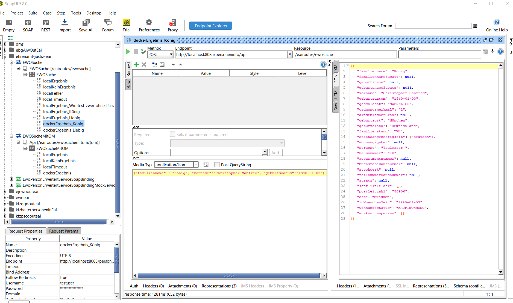
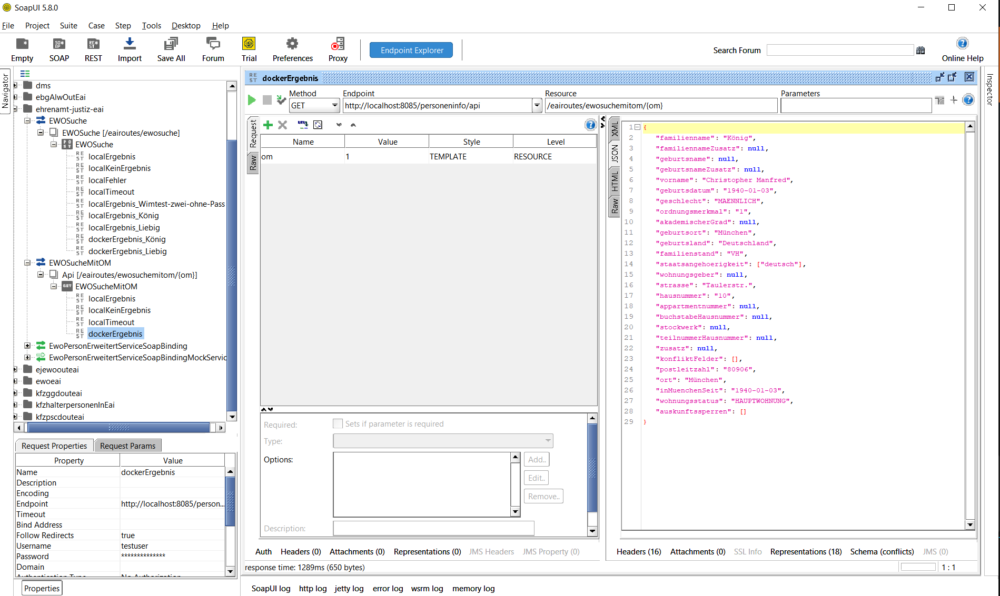

# Residents registration EAI (Enterprise application integration)

The Residents registration EAI has the task of determining personal data from the residents' registration system (e.g. first name, surname, address). The EAI is used in the core application, the online application and the residents registration change service. This EAI is used to decouple the interface to the residents' registration system from the application Ehrenamt-Jusitz. In its current state, the interface provides a connection to the EWO system of the AKDB (Anstalt für Kommunale Datenverarbeitung in Bayern). If a different connection is required for a different system, this EAI must be adapted. Two requests are supported:

| Requestname | Params | Response |
| ------------- | ------------- | ------------- |
| ewosuche  | vorname (first name), nachname (surname), geburtsdatum (date of birth) | personal data e.g. first name, surname and adress |
| ewosuchemitom | OM (id of personal data) | personal data e.g. first name, surname and adress |

Response Data in detail:

| name | datatype | example |
| ------------- | ------------- | ------------- |
| familienname | string | König |
| familiennameZusatz | string | |
| geburtsname | string | |
| geburtsnameZusatz | string | |
| vorname | string | Christopher |
| geburtsdatum | java.time.LocalDate | 1940-03-10 |
| geschlecht | enum Geschlecht {MAENNLICH("maennlich"), WEIBLICH("weiblich"), DIVERS("divers"), UNBEKANNT("unbekannt")} | |
| ordnungsmerkmal | string | 4711 |
| akademischerGrad | string | |
| geburtsort | string | München |
| geburtsland | string | Deutschland |
| familienstand | string | VH |
| staatsangehoerigkeit | java.util.List<String> | ["deutsch"] |
| wohnungsgeber | string | |
| strasse | string | Ludwigstr. |
| hausnummer | string  | 13 |
| appartmentnummer | string | |
| buchstabeHausnummer | string | |
| stockwerk | string | |
| teilnummerHausnummer | string | |
| zusatz | string | |
| konfliktFelder  | java.util.List<String>  | ["strasse", "hausnummer"] |
| postleitzahl | string | 80634 |
| ort | string | München |
| inMuenchenSeit | java.time.LocalDate | 1940-03-10 |
| wohnungsstatus | enum Wohnungsstatus {HAUPTWOHNUNG("hauptwohnung"), NEBENWOHNUNG("nebenwohnuung")} | Hauptwohnung |

The API ist definied here:

[API](https://github.com/it-at-m/ehrenamt-justiz/tree/main/ehrenamt-justiz-api/src/main/java/de/muenchen/ehrenamtjustiz/api)

## Configuration

Configuration of this EAI in application-[profile].yml:

| Configuration | Description                                                                                                                                                                                          | Default setting |
| ------------- |------------------------------------------------------------------------------------------------------------------------------------------------------------------------------------------------------| ------------- |
| spring.port | Port used to run the spring boot application                                                                                                                                                         | 8085 |
| ewo.eai.url | url of residents' registration system                                                                                                                                                                | http://.... |
| producer.user | User for authentication on residents' registration system.  In a podman environment, this user must be defined in docker-compose.yml in the environment variable “PRODUCER_USER”.            |  |
| producer.password | Password for authentication on residents' registration system. In a podman environment, this password must be defined in docker-compose.yml in the environment variable “PRODUCER_PASSWORD”. |  |
| api.auth.users.username | User for authentication on this EAI                                                                                                                                                                  |  |
| api.auth.users.password | Password for authentication on this EAI                                                                                                                                                              |  |

## SoapUI

The EAI can be tested with SoapUI. The xml project to be imported into SoapUI can be found here:

[ehrenamt-justiz-soapui-project.xml](https://github.com/it-at-m/ehrenamt-justiz/blob/main/ehrenamt-justiz-eai/src/test/resources/ehrenamt-justiz-soapui-project.xml)

Example of an EAI call in SoapUI with the parameters first name, last name and date of birth:



Example of an EAI call in SoapUI with the parameter om:



## Start EAI
Change to the folder "ehrenamt-justiz-eai" and call the following scripts depending on your operating system

| Betriebssystem | Profile            |  Script                 |
|:---------------|:-------------------|:------------------------|
| Windows        | Local              | runLocal.bat            |
| Linux          | Local              | runLocal.sh             |

# Logging

Logging is controlled via configuration file application-*.yml. logback-spring.xml is no longer used.

Example:

```
logging:
  include-application-group: false # disabled because application group is only relevant when deployed
  structured:
    format:
      console: # set to empty to disable structured logging locally
  level:
    root: INFO
    de.muenchen.ehrenamtjustiz.eai.personeninfo.processor.CountingProcessor: TRACE
    de.muenchen.ehrenamtjustiz.eai.personeninfo.filter.RequestResponseLoggingFilter: DEBUG
    org.apache.camel.Tracing: TRACE
    org.springframework.boot.context.embedded.tomcat.TomcatEmbeddedServletContainer: INFO
    de.muenchen.ehrenamtjustiz.eai.personeninfo: DEBUG
    route.interceptedFrom: WARN
    org.apache.cxf.services: INFO
```