# Frontend of Ehrenamt-Justiz

## Application in the browser

If the application is running local in Docker desktop, it can be opened in the browser with the following link: http://localhost:8083

Screenshots of frontend:

## Welcome

    

## Get started

    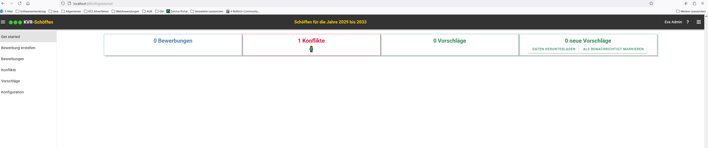

## Create applicant

    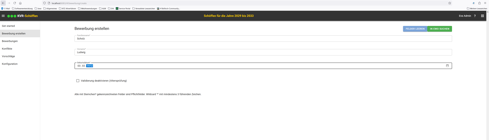

## Selection of a person if several search results were found

    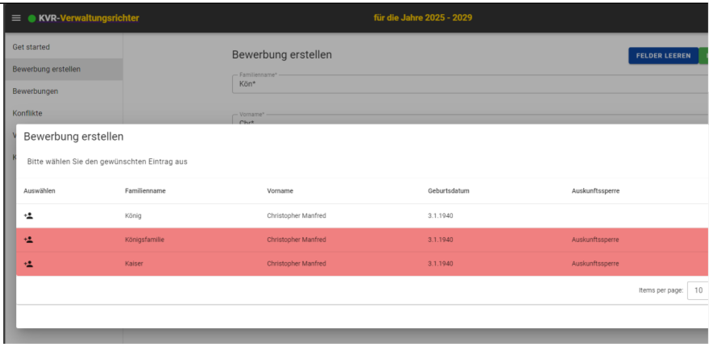

## Display data from the registration system

    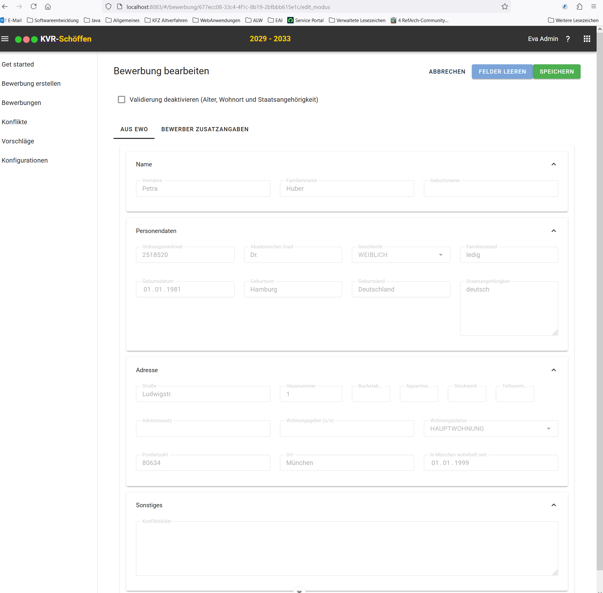

## Edit the additional data of an applicant

    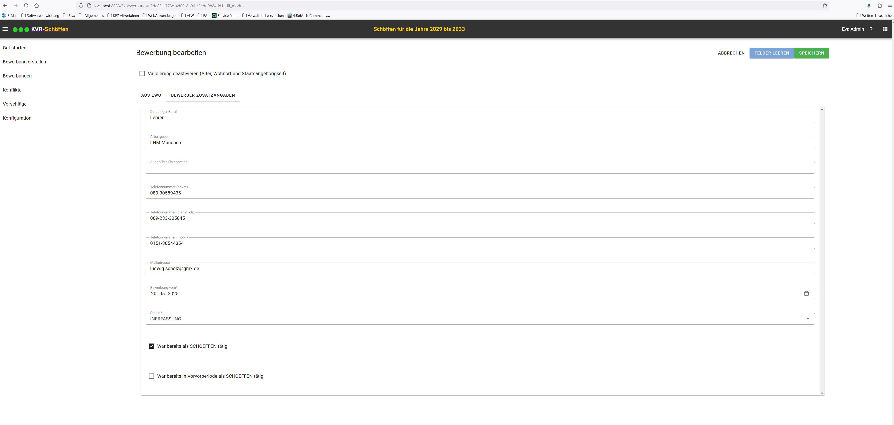

## Overview of applicants

    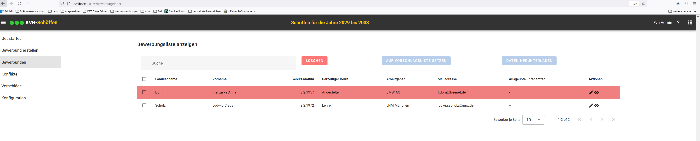

## Overview of conflicts

    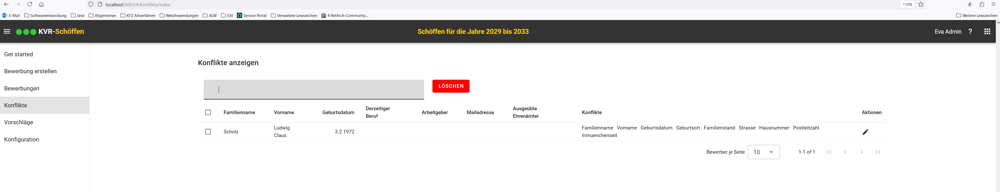

## Resolving conflicts in detailed processing

    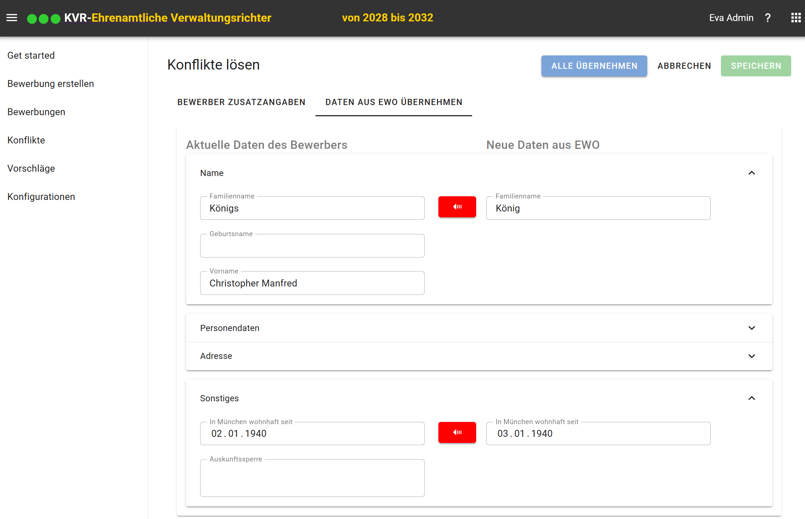

## Overview of the proposed persons

    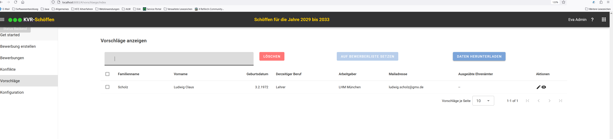

## Saving the suggestion list

    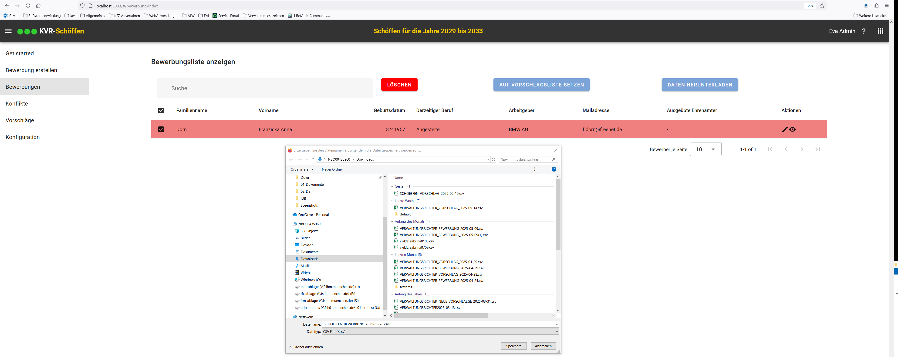

## Suggestion list in csv format

    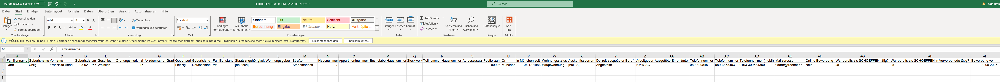

## Marked as notified

    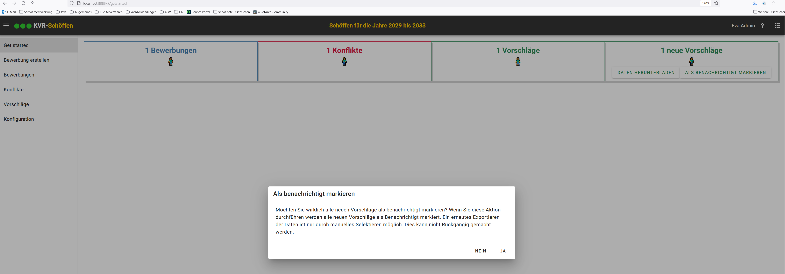

## Overview of the configurations

    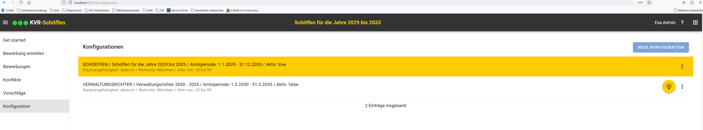

## Detailed processing of the configurations

    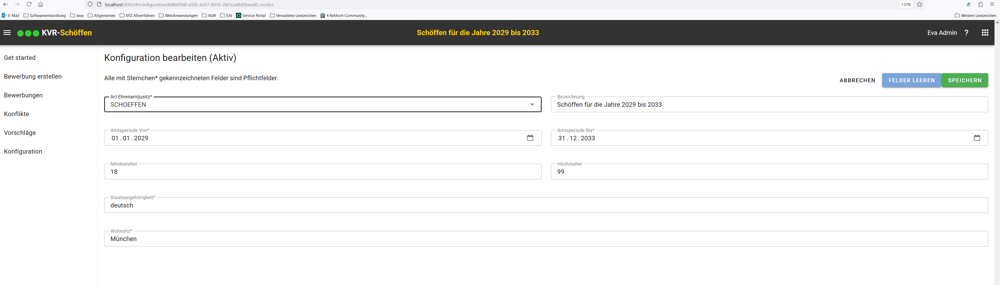

